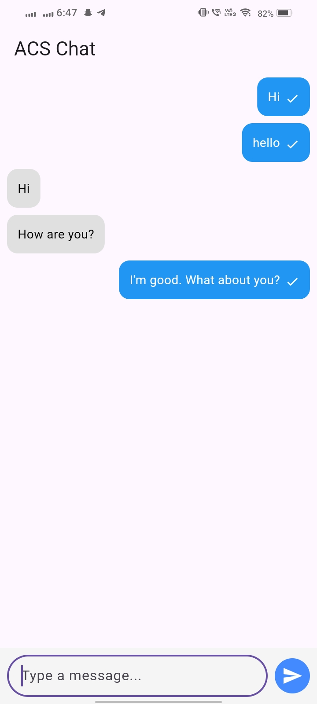
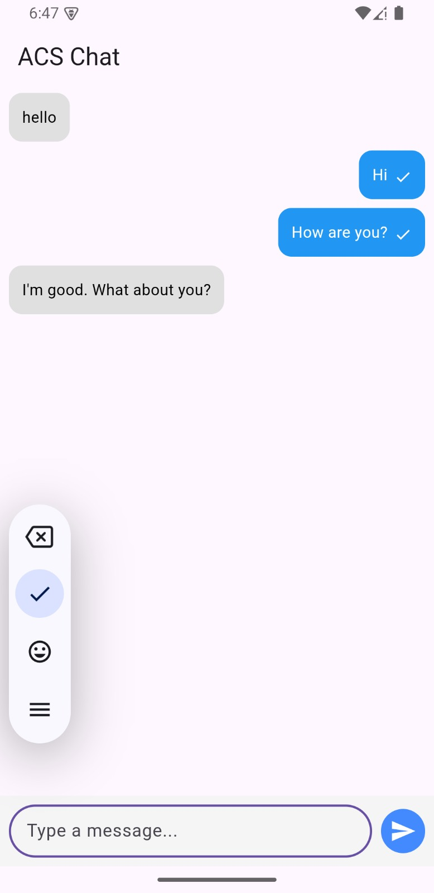

# acs_chat_flutter

[](https://pub.dev/packages/acs_chat)
[](LICENSE)
[](https://flutter.dev)

A Flutter plugin to integrate Azure Communication Services (ACS) **Chat** features using native Android/iOS SDKs.

---

## ✨ Features

- ✅ Real-time chat using ACS
- ✅ Send & receive messages
- ✅ Listen for incoming messages
- ✅ Native implementation using platform channels
- 🔜 Coming soon: Calling support via ACS Calling SDK

---

## 🚀 Getting Started

### 1. Add dependency in `pubspec.yaml`

```yaml
dependencies:
  acs_chat_flutter: ^0.0.1


```
---

## 📸 Screenshots

| Chat UI | Message Handling |
|--------|------------------|
|  |  |
